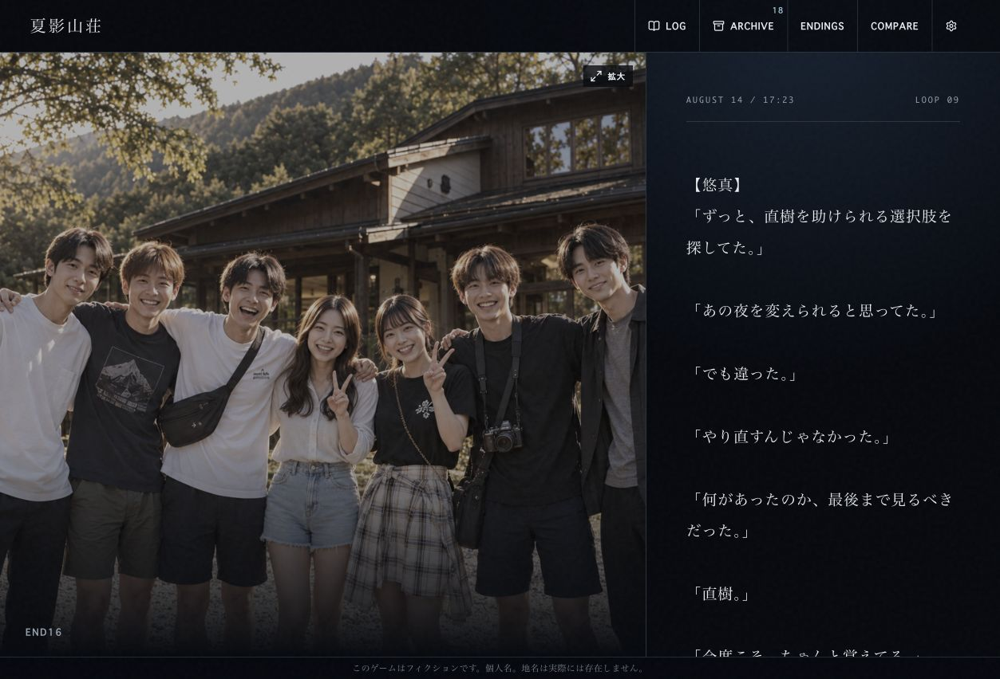
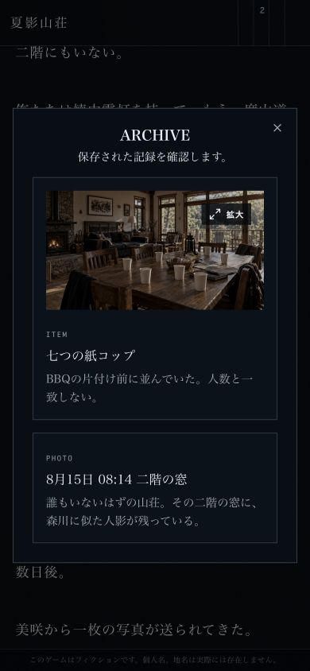
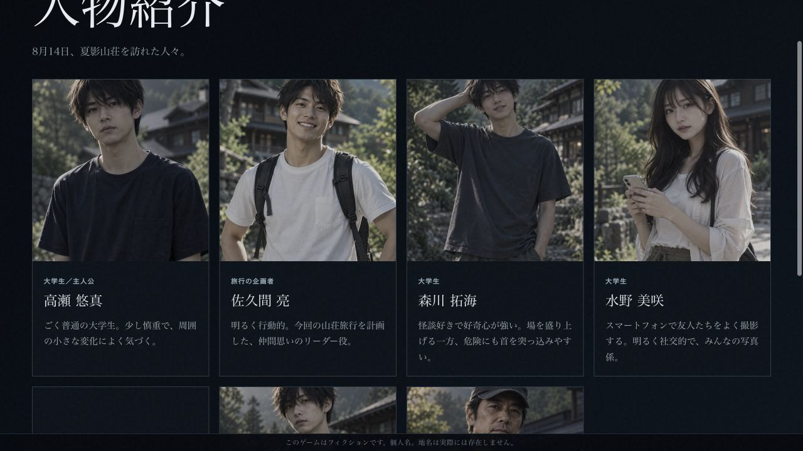
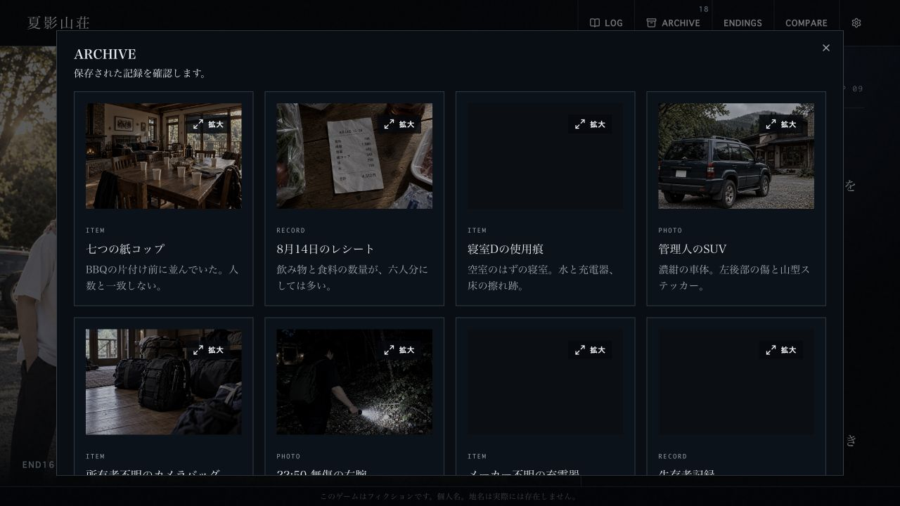

# 夏影山荘 帯域削減 実装レポート

実施日：2026-10-08 JST。基準コミット：9e4e655c815c5db50f39f1dbf1e86001df2d2c33。
作業ブランチ：codex/optimize-bandwidth。公開先は既存の https://natsukage-sanso.onrender.com/。

## A. 修正ファイル

- `lib/game/characters.ts`：人物紹介専用WebPへ参照変更（8人、直樹の解放条件維持）。
- `lib/game/assets.ts`：夜の山荘2スロットだけ同一の可逆WebP URLへ。
- `app/page.tsx`：ARCHIVEのカードだけサムネイルとlazy loading。COMPARE・拡大・通常シーンは原寸。
- `app/scene-overrides.css`：サムネイルのカード配置。既存の色補正と拡大ボタンを維持。
- `scripts/generate-display-images.py`：派生画像の再生成、原寸ハッシュ記録。
- `tests/bandwidth.test.ts`：派生画像の存在、原寸保持、参照、サイズ予算の検証。
- `public/assets/display/`：24画像。原寸PNGは削除・変更なし。

ストーリー、scene/evidence ID、フラグ、localStorage、認証、SIM3、Renderサービス設定・health checkは変更なし。起動スクリプトは下記理由で変更。

## B. 新規画像（MBは1,000,000 bytes）

|ファイル|用途|寸法|元MB|派生KB|削減率|
|---|---|---:|---:|---:|---:|
|`public/assets/display/character_aizawa_naoki_display.webp`|character|768×1152|2.278|104.1|95.43%|
|`public/assets/display/character_komiya_ayaka_display.webp`|character|768×1152|2.203|112.1|94.91%|
|`public/assets/display/character_kuze_ryuichi_display.webp`|character|768×1152|2.094|105.9|94.94%|
|`public/assets/display/character_mizuno_misaki_display.webp`|character|768×1152|2.313|124.4|94.62%|
|`public/assets/display/character_morikawa_takumi_display.webp`|character|768×1152|2.159|96.3|95.54%|
|`public/assets/display/character_sakuma_ryo_display.webp`|character|768×1152|2.297|111.6|95.14%|
|`public/assets/display/character_takase_yuma_display.webp`|character|768×1152|2.192|76.5|96.51%|
|`public/assets/display/character_todo_keisuke_display.webp`|character|768×1152|2.180|84.5|96.13%|
|`public/assets/display/crime_2231_thumb.webp`|archive|640×360|2.533|68.6|97.29%|
|`public/assets/display/damaged_name_tag_thumb.webp`|archive|640×360|2.281|55.8|97.55%|
|`public/assets/display/group_1718_thumb.webp`|archive|640×427|2.467|88.2|96.42%|
|`public/assets/display/group_1718_hq_thumb.webp`|archive|640×427|2.627|88.9|96.62%|
|`public/assets/display/kuse_suv_thumb.webp`|archive|640×360|2.689|84.2|96.87%|
|`public/assets/display/living_seven_cups_thumb.webp`|archive|640×427|2.241|69.9|96.88%|
|`public/assets/display/naoki_0815_0612_thumb.webp`|archive|640×427|2.942|86.5|97.06%|
|`public/assets/display/receipt_1528_thumb.webp`|archive|640×427|2.540|62.7|97.53%|
|`public/assets/display/roadcam_0625_thumb.webp`|archive|640×360|2.874|74.9|97.39%|
|`public/assets/display/room_d_charger_thumb.webp`|archive|640×427|2.388|50.8|97.87%|
|`public/assets/display/survival_record_thumb.webp`|archive|640×360|1.523|9.2|99.39%|
|`public/assets/display/true_end_group_1723_thumb.webp`|archive|640×427|2.725|92.2|96.62%|
|`public/assets/display/unknown_camera_bag_thumb.webp`|archive|640×427|2.212|50.2|97.73%|
|`public/assets/display/vehicle_1723_archive_thumb.webp`|archive|640×360|2.894|99.2|96.57%|
|`public/assets/display/wound_record_2250_clean_thumb.webp`|archive|640×360|2.247|52.5|97.66%|
|`public/assets/display/lodge_blackout_2310_lossless.webp`|background_lossless|1536×1024|2.556|1752.9|31.41%|

## C–E. 変更前後の画像総量

|対象|変更前|変更後|削減率|
|---|---:|---:|---:|
|初回人物7枚|15.438 MB|0.711 MB|95.39%|
|人物全8枚|17.715 MB|0.815 MB|95.40%|
|ARCHIVE全15画像|37.182 MB|1.034 MB|97.22%|
|夜山荘2 URL → 共通1 URL|5.112 MB|1.753 MB|65.71%|

ARCHIVEの旧37.18MBと新1.03MBは一覧用の全ファイルを比較した値。実際には遅延読み込みが働く。また通常シーンで既に読んだ原寸はキャッシュされるため、この差を全プレイ削減量に重ねて加算してはいけない。

## F. 原寸証拠画像の保持

拡大およびCOMPAREは以下の原寸PNGを維持。画像内文字・人数・車両・時刻の画素を変更しない。

- `public/assets/generated/crime_2231.png`
- `public/assets/generated/damaged_name_tag.png`
- `public/assets/generated/group_1718.png`
- `public/assets/generated/group_1718_hq.png`
- `public/assets/generated/kuse_suv.png`
- `public/assets/generated/living_seven_cups.png`
- `public/assets/generated/naoki_0815_0612.png`
- `public/assets/generated/receipt_1528.png`
- `public/assets/generated/roadcam_0625.png`
- `public/assets/generated/room_d_charger.png`
- `public/assets/generated/survival_record.png`
- `public/assets/generated/true_end_group_1723.png`
- `public/assets/generated/unknown_camera_bag.png`
- `public/assets/generated/vehicle_1723_archive.png`
- `public/assets/generated/wound_record_2250_clean.png`

全既存PNGについてGit差分がないことを確認。派生元のSHA-256は`images.json`に保存。

## G. 変換と背景判断

人物は幅768px・品質90、ARCHIVEは幅640px・品質88のWebP。いずれも一覧表示用途に限定。
夜山荘は元寸法の可逆WebP。デコード後のRGBA画素が元PNGと完全一致することをassertで確認。
`lodge_return_night_2310.png`と`lodge_blackout_2310.png`の原寸は両方残し、配信URLだけ共通化。
山荘到着、旅行前集合、山道、車両、橋等は人物・建物・車両・小物の細部を含むため原寸のまま。目標サイズ優先の非可逆圧縮は行わない。

## H. テスト結果

- 既存34件＋追加3件＝37件成功。ビルド成功。Git差分形式チェック成功。
- Chrome PCで新規ローカル認証から人物紹介、END01/02/03/04/05/10/13/14/15、INVESTIGATION、TRUE ROUTE、最終捜査、TRUE ENDまでUI操作で到達。
- 9エンディング後のリロード復元確認。SIM3リンクがTRUE ENDのみ1つ表示、既存URL維持。
- ARCHIVE 10件一覧のDOMで`/assets/display/*_thumb.webp`と`loading=lazy`確認。
- 七つの紙コップをクリックし、拡大表示が`living_seven_cups.png`であることを確認。
- COMPAREで17:18復元・06:25路肩カメラを選択。`group_1718_hq.png`と`roadcam_0625.png`の原寸参照確認。
- Chromium相当390×844で新規認証・人物・END01・ARCHIVE・拡大を操作。サムネイルと人物識別に問題なし。端末実機/Safariは未検証。
- ブラウザの観測アセット一覧で初回7人が表示用WebPであり、人物の原寸PNGが取得対象にないことを確認。認証画面背景の到着PNGは従来通り読み込む。
- DevToolsの転送量実測値は取得できていないため、以下は取得URL集合と実ファイルサイズに基づく推計。ローカル開発JSサイズは本番推計に使わない。
- 当初はキャッシュを変更せず公開したが、既存Wrangler起動の内部ポートをRenderが誤検出（39039）し502が発生。`scripts/start-render.mjs`を標準`vinext start`へ切替。公開HTTPポートのみで動作させる。
- Node本番モードの新規認証・END01操作をChromeで検証。画像レスポンスは`public, max-age=3600`、ETag、Last-Modified付き。固定URLにimmutableは付かない。JS/CSSはハッシュ付きURLのimmutableを維持。公開再検証記録に応答を保存。

## I. 想定1プレイ転送量

今回UIで通した主要ルート（69シーン、9通常END＋TRUE END、人物初回7名）で、同一URLは一度だけ取得する空キャッシュの画像総量：

- 修正前：約72.52MB（ARCHIVEのみの追加原寸・JS/CSS等は含めない下限）。
- 修正後：約55.47MB（全15サムネイルも取得する保守的見積もり）。
- この条件で約23.5%削減。画像以外を含め通常約56〜60MB程度が目安。

従来の広範囲70〜95MBと比べ、主要ルートは55.5MB前後。全15END・全証拠拡大ではさらに原寸が必要。15〜30MB目標は未達。証拠品質を維持する条件下では、今回の派生画像だけでその水準まで下がるとは言えない。

5GBを画像量だけで割った主要ルート目安は約69→90回。初回人物画面中心のアクセスでは約95%削減だが、全証拠探索中心なら効果は小さくなる。
月6.15GBが自動的に0.9〜2.5GBになるとは断定できない。過去の累計は減らないため、デプロイ前後の同期間・同程度アクセスでMetricsを比較する。

未使用素材は削除なし：`public/assets/reference/`、公開ディレクトリの`.DS_Store`、template SVG等は通常参照されない限り帯域を消費しない。既存調査一覧はARGルートの`bandwidth-audit/2026-10-08/REPORT.md`を参照。

## 公開起動方式の追加修正

最初の画像公開コミット：`d5ee91b801886dc887cda6a23e1d53821707771a`。RenderでLiveになった後に502が返り、ログに内部ポート誤検出とworkerd RPCエラーを確認。画像変更に由来するエラーではない。標準Node本番サーバーへ起動のみ切替。サービスURL・プラン・healthCheckPathは維持。

## 公開後の確認結果

- 公開コミット：`b862befcfff75587f891dddc90f965070d695cc2`。
- Render：Live（起動修正のデプロイ時間2分43秒）。
- 確認日時：2026-10-08T18:03:59.723620+09:00
- トップ＋24派生画像：全25 URLがHTTP 200。全派生画像Content-Type `image/webp`。
- 固定画像：`public, max-age=3600`、ETag、Last-Modifiedあり。If-None-MatchでHTTP 304。
- 公開版：人物紹介で幅768のWebP、ARCHIVEで軽量サムネイル、レシート拡大で原寸PNGを確認。
- 公開版の既存テストセーブを維持してEND01/02/03/04/05/10/13/14/15、INVESTIGATION、TRUE ROUTE、最終捜査、TRUE ENDまでUI操作。公開版クリア後リロード→つづきからでTRUE ENDとSIM3リンクを復元。
- 新規認証は開発モードとNode本番モードの空ローカルセーブで確認。本番の認証済みセーブは削除していない。
- 起動方式切替後、Node本番モードでも同じ9END＋TRUE ENDを再テスト。
- 詳細レスポンスは`public-verification.json`。公開後の累積月間帯域低下はまだ測定できない。

